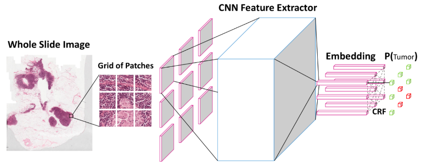

# NCRF
## architecture

## result
### patch-level to wsi-level ( 4种尝试 )
1.	假设剩余有效的patch数为N,，则该WSI共包括4 * N 个具有分类标签的grid，我们对标签结果进行统计，若判定为亚型A的grid的总数大于判定为亚型B的grid总数，则该WSI判定为亚型A。采用该方法在151张WSI测试集中测试，得到的结果显示：Accuracy=0.83, AUC=0.9388。
2.	采用逻辑回归的方法对patch结果进行综合，以判定为亚型A的grid数量和判定为亚型B的grid数量作为输入训练线性逻辑回归，得到的结果为：Accuracy=0.8543， AUC=0.8591。在当前的测试集中其有着较高的准确率，但是过低的AUC指标反映了逻辑回归处理容易造成过拟合的弊端。
3.	对于一张已划分四个网格的Patch，我们令这四个网格分别为A，B，C，D，假设经NCRF分类网络判定后得到的标签值为1，0，1，0。我们对这四个网格的像素值之和进行统计，因为空白区域越多，像素值之和越大，所以我们假定像素值越低的grid包含越多的有效信息，那么就给予该网格更大的权重，假设这四个网格的像素值之和大小为A < B < C< D，则他们对应的权重分别为0.4，0.4，0.1，0.1。最后的patch得分为四个网格的得分结果综合，即为1 * 0.4 + 0 * 0.4 + 1 * 0.1 + 0 * 0.1 = 0.5。我们采用同样的方法计算一张WSI图片中所有的有效patch，最后的WSI得分即为所有patch得分的均值，该方法实验结果为：Accuracy=0.8344， AUC=0.9403，该方法的结果优于简单的投票机制，但是在准确率上没有过大的提高，可能在权重更适合的权重可以略微改善准确率。
4.	对于patch，设计简单的三层CNN进行分类来判定该patch是否是具有区分意义，使用NCRF对该patch进行分类，若其分类所得的结果与该patch的真实结果（A、B亚型）相同，则在这个辅助网络中认定真实标签为1，即该patch为具有区分意义的patch，否则即为0。在训练过程中，在该假定下判定的结果达到80%的准确率，但同样在steps=300k后loss出现突增，acc突降，在测试集中测试结果也十分不理想，这也说明对于patch是否具有意义，其仍需要人工进行标定才能用以训练，或者至少是分类网络具有极高的分类准确率，但其实在拥有极高的分类准确率后并不需要使用此类方法来进行辅助的结果综合，因此我认为这种方法是在没有人为的标签时是不可行的。
